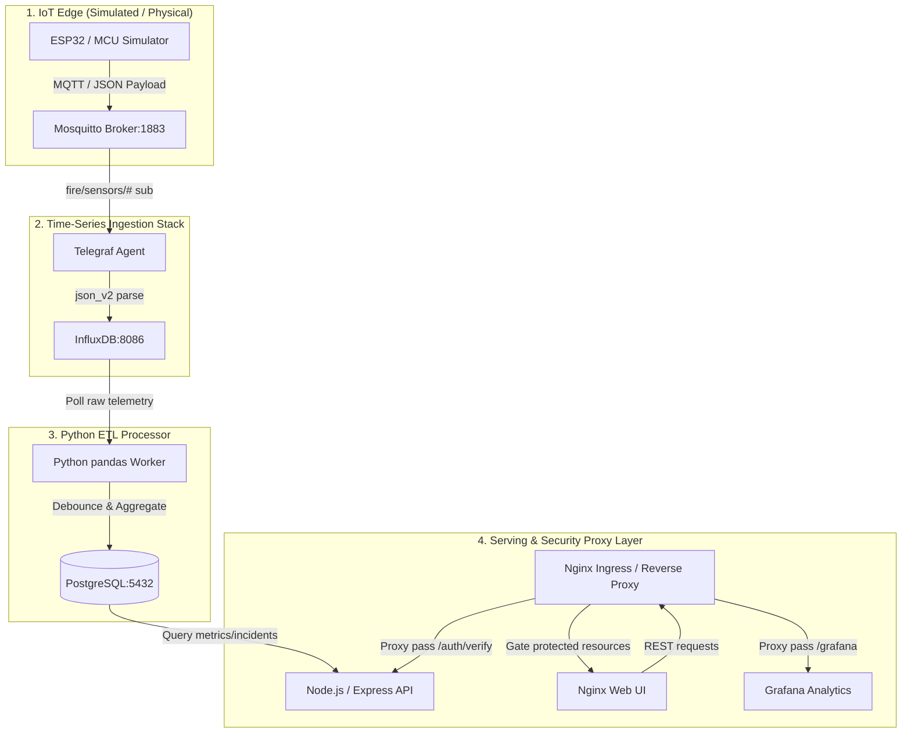

# IoT-Based Fire Monitoring & Cloud-Native Analytics Platform

[](#)
[](#)
[%20%7C%20ArgoCD-red.svg)](#)
[](#)

Welcome to the **IoT-Based Fire Monitoring & Cloud-Native Analytics Platform**! This repository serves as a high-fidelity platform for exploring **Cloud-Native Infrastructure**, **GitOps**, and **Zero-Trust Security**. 

Rather than a monolithic setup, this repository is designed as a decoupled microservice topology. This root README acts as the central hub and navigation index.

---

## 🛰️ High-Level System Architecture & Ingestion Flow

The platform implements a real-time reactive streaming architecture, processing high-volume time-series sensor data and piping it safely into relational analytical logs.



---

## 📂 System Component Directory Mapping

---

### 🟢 1. Node.js Express REST API (`apps/api/`)
*   **Top-Level Explanation:** The backend server acts as the primary data orchestrator and user session controller. It manages user authentication (gated approval queue), serves dashboard metrics, maps historical chart queries, registers official fire reports, and exposes raw Prometheus metrics.
*   **Key Technical Implementations:**
    *   **Persistent Sessions:** Integrates `express-session` with `connect-pg-simple` to store active cookie sessions inside a PostgreSQL table, preventing session drops during pod restarts.
    *   **Prometheus Instrumentation:** Uses `prom-client` to export garbage collection, CPU utilization, and HTTP request duration histograms (`http_request_duration_seconds`).
    *   **Secure Routing Gate:** Implements trust proxy configurations and acts as an Nginx Auth-Proxy subrequest target for gating access to Grafana.
*   **Direct Link to Guide:** 
    *   👉 [**Express REST API Complete Guide 📖**](./apps/api/README.md)

---

### 🔵 2. Nginx Web Dashboard (`apps/dashboard/`)
*   **Top-Level Explanation:** The web portal acts as the user interface, serving static HTML5, CSS3, and client-side JavaScript analytics dashboards.
*   **Key Technical Implementations:**
    *   **Reverse Proxy Gating:** Configured with Nginx `auth_request` to run session handshakes on the Express API `/auth/verify` endpoint before serving protected routes or assets.
    *   **Embedded Analytics:** Proxies traffic to the Grafana endpoint (`/grafana`) while dynamically injecting authenticated user headers and roles to support secure embedded iframe dashboards.
    *   **Performance Tuning:** Enforced with Gzip compression and custom static caching rules (30-day cache-control headers).
*   **Direct Link to Guide:**
    *   👉 [**Nginx Web Dashboard Complete Guide 📖**](./apps/dashboard/README.md)

---

### 🟡 3. Python pandas ETL Processor (`apps/etl-processor/`)
*   **Top-Level Explanation:** A Python worker service running on a loop to bridge time-series storage and relational PostgreSQL layers.
*   **Key Technical Implementations:**
    *   **Data Wrangling & Downsampling:** Uses `pandas` to query raw telemetry from InfluxDB and aggregate normal status signals into 5-minute rollups to prevent PostgreSQL database bloat.
    *   **30-Minute Anomaly Debouncing:** Implements debouncing logic that checks if an active incident exists for a household tag. If active, it updates the `last_seen_at` and upserts severity to the greatest value; if resolved, it closes the incident.
    *   **Connection Resilience:** Uses a singleton PostgreSQL pool connection pattern with robust error rollback blocks to handle network disconnects.
*   **Direct Link to Guide:**
    *   👉 [**Python pandas ETL Complete Guide 📖**](./apps/etl-processor/README.md)

---

### 🟣 4. IoT Fleet Simulator (`apps/simulators/`)
*   **Top-Level Explanation:** A lightweight Python MQTT publisher that emulates physical microcontrollers streaming real-world sensor data.
*   **Key Technical Implementations:**
    *   **MQTT Streaming:** Uses `paho-mqtt` to publish flat JSON telemetry packages containing household ID (`h_id`), coordinate maps (`lat`, `lon`), and alert values (`status`).
    *   **Edge State Machine:** Emulates realistic environmental conditions by running a randomized state selector generating 85% normal, 12% warning, and 3% critical alert readings.
*   **Direct Link to Guide:**
    *   👉 [**IoT Fleet Simulator Complete Guide 📖**](./apps/simulators/README.md)

---

### 🟤 5. Multi-Layer Terraform IaC (`infrastructure/terraform/`)
*   **Top-Level Explanation:** Infrastructure-as-code orchestration mapping DigitalOcean resources across environments using an isolated sequential structure.
*   **Key Technical Implementations:**
    *   **Sequential Orchestration Layers:** 
        *   `00-bootstrap`: Configures remote DO Spaces state buckets and locking.
        *   `01-infra`: Provisions VPCs, managed DOKS clusters, and DNS delegation.
        *   `02-platform`: Deploys cluster Helm charts (ArgoCD, Ingress-Nginx) and base secrets.
        *   `03-argocd`: Orchestrates Github App secrets sync and registers the root ArgoCD application.
    *   **S3/Spaces Remote State Split:** Restructures state paths so `dev` and `prod` state keys remain isolated, eliminating concurrent modification risks.
*   **Direct Link to Guide:**
    *   👉 [**Terraform IaC Complete Guide 📖**](./infrastructure/terraform/README.md)

---

### 🔘 6. Kubernetes GitOps Manifests & Ingress (`infrastructure/k8s/`)
*   **Top-Level Explanation:** Contains declarative manifests and configurations managed by Kustomize and reconciled by ArgoCD.
*   **Key Technical Implementations:**
    *   **Kustomize Overlays:** Base manifests represent shared components, while overlays for `dev` and `prod` inject unique namespaces, scale limits, and domain configs.
    *   **PreSync Schema Hooks:** Launches Flyway migration Docker containers as a Kubernetes `Job` inside a PreSync hook, ensuring schemas are upgraded before updating app pods.
    *   **Network Policies:** Standardizes Zero-Trust security rules, enforcing default-deny firewalls that restrict pod-to-pod network paths.
*   **Direct Link to Guide:**
    *   👉 [**Kubernetes Manifests & Ingress Complete Guide 📖**](./infrastructure/k8s/README.md)

---

### 🟠 7. Automated CI/CD Pipelines (`.github/workflows/`)
*   **Top-Level Explanation:** Houses the automated GitHub Actions pipelines that orchestrate application continuous integration, validation checks, and GitOps image tag promotion.
*   **Key Technical Implementations:**
    *   **Change-Detection Matrix Parallelism:** Uses `dorny/paths-filter` to only compile and test the specific services that modified files belong to, optimizing workflow run times.
    *   **GitOps Manifest PR Auto-Generation:** Automatically runs Kustomize image tag overrides and registers a new Pull Request against `main` using GitHub App credentials.
    *   **Manifest Validation Safeguards:** Automatically tests Kustomize layout compiles on dev, prod, and local environments on push triggers.
*   **Direct Link to Guide:**
    *   👉 [**Automated CI/CD Pipelines Complete Guide 📖**](./docs/portfolio/03_CI_CD_PIPELINES.md)

---

## 🚦 Local Developer Quickstart

To boot the system locally using Docker (or Podman) Compose for verification:

### 1. Environment Configuration
Copy the configuration variables template:
```bash
cp .env.example .env
```
Ensure you provide secure passwords for Postgres, InfluxDB tokens, and target host ports.

### 2. Boot the Development Stack
Expose database, broker, API, and monitoring ports for debugging:
```bash
docker compose -f docker-compose.yml -f build/compose/docker-compose.dev.yml up -d
```

### 3. Stream Telemetry
Launch the edge device simulator in a virtual environment to stream mock payload events:
```bash
cd apps/simulators
python -m venv venv
source venv/bin/activate
pip install -r requirements.txt
python mcu_sim.py --host localhost --port 18830 --h-id REYES_P --interval 5.0
```

### 4. Check Health & Analytics
*   **Web Dashboard:** Accessible at [http://localhost](http://localhost) (Nginx reverse-proxy ingress).
*   **API Health:** Check [http://localhost:8000/health](http://localhost:8000/health).
*   **API Custom metrics:** View raw Prometheus endpoints at [http://localhost:8000/metrics](http://localhost:8000/metrics).
*   **Grafana Analytics:** Accessible at [http://localhost:3000](http://localhost:3000) (auth-gated).

---

## 📖 Related Operational Runbooks
*   [**End-to-End Deployment & Verification Guide 📖**](./docs/portfolio/DEPLOYMENT_GUIDE.md): Step-by-step pipeline lifecycle from local sandbox (Docker/Kind) to production cloud (DigitalOcean/ArgoCD) with credit-saving strategies.
*   [**GitOps Operations Runbook 📖**](./docs/portfolio/OPERATIONS_GITOPS.md): ArgoCD sync parameters, manual bumps, and deployment pipelines.
*   [**Emergency Runbook & Diagnostics 📖**](./docs/portfolio/OPERATIONS_RUNBOOK.md): DB restore commands, rollback plans, and sync troubleshooting.
*   [**DigitalOcean Cloud Setup Guide 📖**](./docs/portfolio/SETUP_GUIDE.md): Infrastructure boot parameters and remote TF backend setup.
