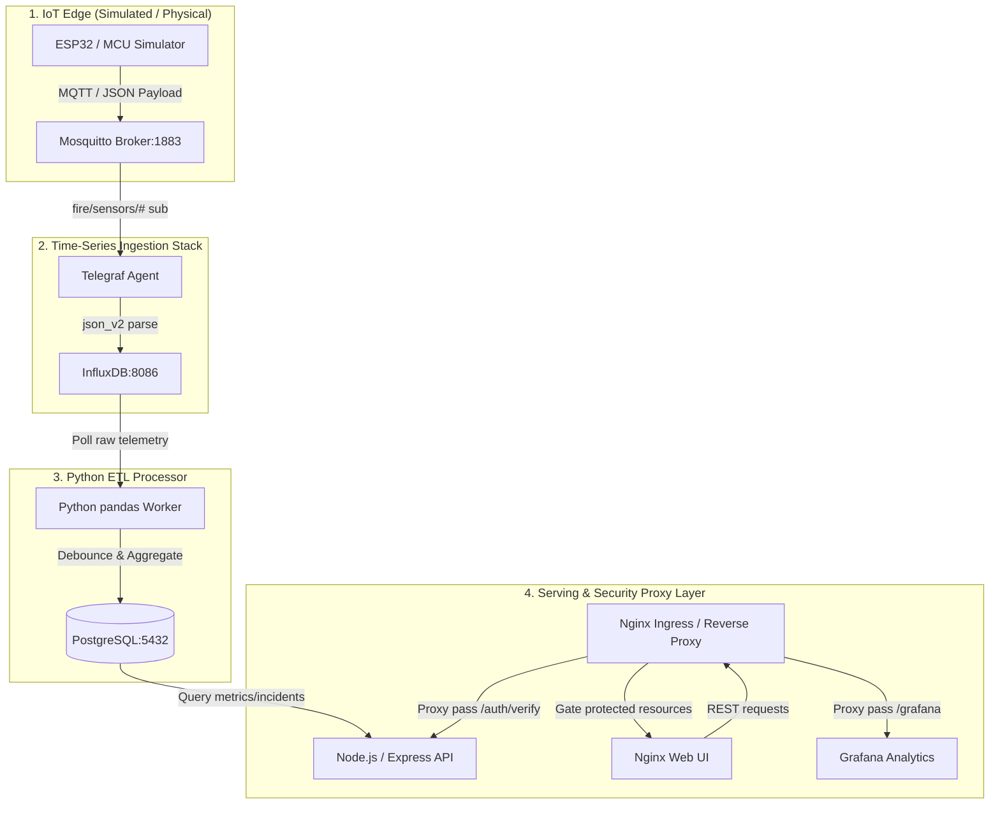

# IoT-Based Fire Monitoring & Cloud-Native Analytics Platform

[](#)
[](#)
[%20%7C%20ArgoCD-red.svg)](#)
[](#)

A high-fidelity, production-hardened platform for exploring **Cloud-Native Infrastructure**, **GitOps**, and **Zero-Trust Security** through a real-world Internet of Things (IoT) telemetry and analytics system. 

---

## 🗺️ System Topology & Data Flow

This monorepo powers a complete fire monitoring ecosystem. The data pipeline is built for resilience, low-latency, and high observability, routing telemetry from edge devices to time-series and relational databases:



### 🛰️ Telemetry Lifecycle
1. **MQTT Edge Ingestion:** Simulated edge MCUs publish flat telemetry payloads containing coordinates (`lat`, `lon`), household ID (`h_id`), and alert state (`status` where `0=Normal`, `1=Warning`, `2=Critical`) to topic `fire/sensors/H_ID`.
2. **Telegraf Collection:** The Telegraf consumer agent parses incoming MQTT JSON metrics and stores them as structured fields in InfluxDB (`node_telemetry` measurement).
3. **Python ETL & Anomaly Debouncing:** The Python worker runs on a periodic batch loop. It cleans raw time-series data, aggregates normal signals into 5-minute rollups to prevent PostgreSQL bloat, and runs a **30-minute debouncing window** on anomalies, tracking ongoing alerts under the `historical_fire_incidents` registry.
4. **REST API & Serving:** A Node.js Express server exposes secured endpoints for statistics, Manila-timezone standardized hourly charts, and user/admin controls.
5. **Secure Reverse Proxy:** An Nginx gateway acts as a single ingress point, using the Express API as an auth-proxy delegate before serving protected pages or exposing Grafana.

---

## 🧱 Core Engineering Pillars

*   **Multi-Layer Infrastructure as Code (IaC):** Modular Terraform code managed in sequential stages (**Bootstrap → Infra → Platform → GitOps**) on DigitalOcean to isolate state and limit blast radius.
*   **GitOps Continuous Delivery:** Fully declarative state reconciliation using **ArgoCD** and **Kustomize** to align the cluster state directly with version-controlled manifests.
*   **Zero-Trust Networking:** Logical and network isolation using Kubernetes **NetworkPolicies**. Services operate under a "Default Deny" posture, explicitly allow-listing only validated network paths.
*   **Secure Auth-Proxy Handshake:** The system uses Nginx `auth_request` sub-routing to delegate route authorization. Direct document navigation to Grafana is locked behind the API's authentication middleware.
*   **Full-Stack Observability (LGMA):** Standardized logging and monitoring utilizing **Loki, Grafana, Prometheus, and Grafana Alloy**, featuring pre-provisioned system, database, applications, and network dashboards.

---

## 📂 Repository Layout

```
.
├── .github/workflows/          # CI/CD pipelines (Builds, tag bumps, validation)
├── apps/
│   ├── api/                    # Node.js / Express API (Scraped via prom-client)
│   ├── dashboard/              # HTML/CSS/JS frontend dashboard served via Nginx
│   ├── etl-processor/          # Python data processing worker (pandas + psycopg2)
│   └── simulators/             # Python MQTT IoT device simulator
├── infrastructure/
│   ├── k8s/                    # GitOps manifests & configurations
│   │   ├── base/               # Shared resources (db, influx, mqtt, api, observability)
│   │   │   └── sql/            # Flyway database schema migration scripts
│   │   └── overlays/           # Env overrides (dev, prod, local)
│   ├── nginx/                  # Local Nginx configuration templates
│   ├── telegraf/               # Telegraf parsing definitions
│   └── terraform/              # Multi-layer IaC root
│       ├── modules/            # Reusable modules (cluster, dns, argocd, secrets)
│       └── environments/       # Environment roots (dev, prod)
├── docker-compose.yml          # Root compose mapping to canonical configs
└── build/compose/              # Local docker-compose environments (dev, prod, base)
```

---

## 🛠️ Multi-Layer Terraform Pipeline (`infrastructure/terraform/`)

Infrastructure provisioning is separated into four sequential, independent roots. This isolates cloud infrastructure deployment from cluster application configuration.

| Layer | Path | Responsibility | Managed Resources |
| :--- | :--- | :--- | :--- |
| **00** | `environments/{env}/00-bootstrap` | Remote backend setup | DigitalOcean Spaces (S3 Bucket) for state storage. |
| **01** | `environments/{env}/01-infra` | Cloud core infrastructure | DigitalOcean VPC, Kubernetes Cluster (DOKS), Domain delegation. |
| **02** | `environments/{env}/02-platform` | Cluster core utilities | Namespaces, Ingress Controller, Cert Manager, ArgoCD Helm Chart. |
| **03** | `environments/{env}/03-argocd` | GitOps entry point | Github App secret synchronization, ArgoCD Root Application deployment. |

### Remote State Conventions
States are stored in DO Spaces and locked:
*   State Key Format: `environments/{env}/terraform.tfstate`
*   Common variables and endpoints are specified inside `backend-common.conf`.

---

## 🔄 GitOps & CI/CD Pipelines

The platform follows a **declarative, pull-based delivery pipeline** that prevents configuration drift and isolates secret access.

```
Code Change pushed (apps/) 
   ├── 1. GHA triggers Matrix Build & linting
   ├── 2. Compile image & push to GHCR (tagged with Git commit SHA)
   ├── 3. GHA runs Kustomize bump & submits Pull Request with updated tags
   └── 4. Dev merges PR → ArgoCD reconciles and updates the cluster (~1-2 min)
```

*   **Cost Optimization:** Pipelines use Dorny `paths-filter` to only trigger builds when relevant code changes are detected, reducing build times and CI execution cost by up to 36%.
*   **Database Schema Safety:** Database migrations are run as an ArgoCD `PreSync` hook using **Flyway**. The migrations run and validate successfully before the application pods are updated.

---

## 🛡️ Zero-Trust Security Posture

1.  **NetworkPolicies:** No pods in the system can talk to each other unless explicitly permit-listed. For instance, the database can only receive traffic on port 5432 from the API and ETL pods; the dashboard static UI is fully network-isolated from the datastore.
2.  **Express Session Persistence:** Sessions are stored inside a dedicated PostgreSQL table ([V8__Add_Persistent_Sessions.sql](infrastructure/k8s/base/sql/V8__Add_Persistent_Sessions.sql)) using `connect-pg-simple`. Sessions survive API restarts and pods scales.
3.  **Secure Ingress Auth-Proxy:** Nginx blocks direct path resolution. When a user requests access to protected charts or Grafana, Nginx sends a subrequest to `/auth/verify`. If the Express session is valid, the request is passed with injected metadata headers (`x-user`, `x-user-role`). If access is denied, Nginx rejects it at the edge.

---

## 📊 Observability (LGMA Stack)

Our monitoring architecture is integrated into the Kustomize layouts under [infrastructure/k8s/base/](infrastructure/k8s/base/):
*   **Prometheus:** Configured to scrape cluster container metrics (`cAdvisor`), Kubernetes host details (`node-exporter`), database metrics (`postgres-exporter`), and Express API request duration histograms (`prom-client`).
*   **Loki:** Centralized logging backend receiving logs from every container namespace.
*   **Grafana Alloy:** Collects cluster container logs and maps them dynamically to Loki labels.
*   **Grafana Provisioning:** Dashboards are pre-provisioned via declarative YAML. Changing dashboard states is as simple as committing JSON files under `grafana/dashboards/`.

---

## 🚦 Local Quickstart

### Prerequisites
*   Docker & Docker Compose (or Podman / Podman Compose)
*   Python 3.10+ (for edge simulator testing)

### 1. Configure the Environment
Copy the environment variables template and customize your credentials:
```bash
cp .env.example .env
```
Ensure `DATABASE_URL` matches your local Postgres credentials, and set an `INFLUXDB_TOKEN`.

### 2. Launch the Development Stack
The development stack exposes internal databases, APIs, and brokers for easy testing:
```bash
docker compose -f docker-compose.yml -f build/compose/docker-compose.dev.yml up -d
```
Verify container statuses:
```bash
docker compose ps
```

### 3. Spin up the MCU Simulator
Navigate to the simulator directory, configure your virtual environment, and run the simulator to stream mock telemetry into the pipeline:
```bash
cd apps/simulators
python -m venv venv
source venv/bin/activate
pip install -r requirements.txt
python mcu_sim.py --host localhost --port 18830 --h-id REYES_P --interval 5.0
```

### 4. Check Health & Access Dashboard
*   **Dashboard UI:** Access via [http://localhost](http://localhost) (routed through Nginx).
*   **API Health:** Check [http://localhost:8000/health](http://localhost:8000/health) or via Nginx [http://localhost/health](http://localhost/health).
*   **API Metrics:** Raw Prometheus scrapings are exposed at [http://localhost:8000/metrics](http://localhost:8000/metrics).
*   **Grafana Analytics:** Access directly at [http://localhost:3000](http://localhost:3000) or embedded inside the dashboard (auth-gated in production-mode).

### 5. Cleaning Up
To stop all containers and remove networks:
```bash
docker compose -f docker-compose.yml -f build/compose/docker-compose.dev.yml down
```

---

## 📖 Operational Runbooks & Guides

For detailed guides, please refer to the following documentation:
1.  **[GitOps & K8s Architecture Guide](./docs/portfolio/02_KUBERNETES_GITOPS.md)**: Details Kustomize configurations and Argo CD setups.
2.  **[CI/CD Workflow Operations](./docs/portfolio/03_CI_CD_PIPELINES.md)**: Explains path-based filters and manual trigger parameters.
3.  **[Operational Runbook](./docs/portfolio/OPERATIONS_RUNBOOK.md)**: Emergency rollback instructions, database restoration, and troubleshooting sync failures.
4.  **[Setup Guide & Remote State Migration](./docs/portfolio/SETUP_GUIDE.md)**: Instructions for setting up DigitalOcean CLI and bootstrapping Terraform.
