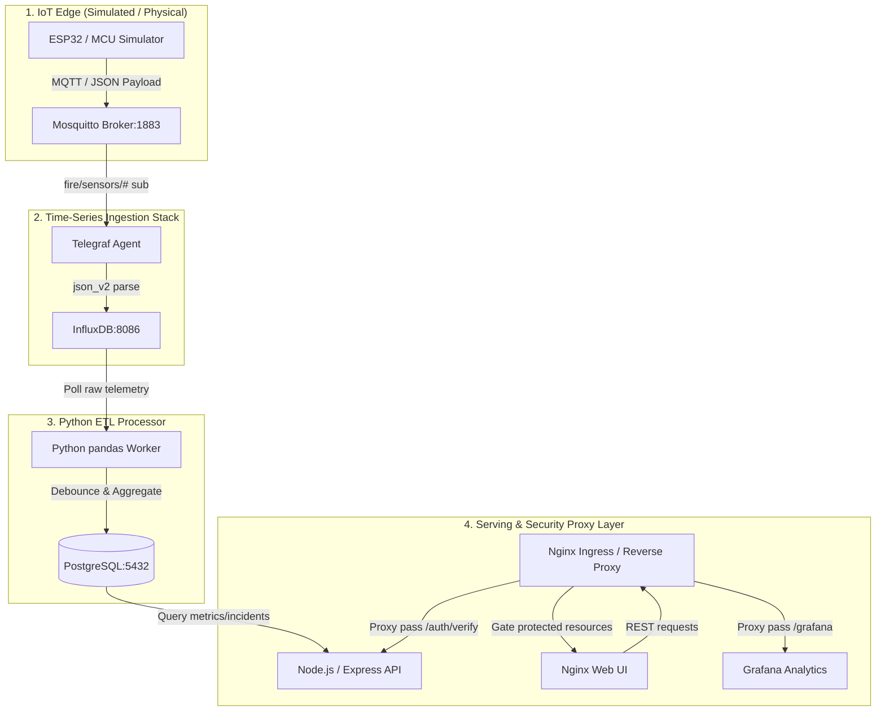

# IoT-Based Fire Monitoring & Cloud-Native Analytics Platform

[](#)
[](#)
[%20%7C%20ArgoCD-red.svg)](#)
[](#)

Welcome to the **IoT-Based Fire Monitoring & Cloud-Native Analytics Platform**! This repository serves as a high-fidelity platform for exploring **Cloud-Native Infrastructure**, **GitOps**, and **Zero-Trust Security**. 

Rather than a monolithic configuration, this codebase is structured modularly. This root README acts as the central hub to help you navigate through the documentation and source directories.

---

## 📂 Codebase Navigation Index

Use the links below to navigate directly to the detailed configuration, deployment, and execution runbooks for each component:

```
.
├── 📂 apps/                                 # Click below to view microservices guides:
│   ├── 📄 README.md ────────────────────────> [Apps Hub Navigation Page] (apps/README.md)
│   ├── 📂 api/ ─────────────────────────────> [Express REST API Guide] (apps/api/README.md)
│   ├── 📂 dashboard/ ───────────────────────> [Nginx Web Dashboard Guide] (apps/dashboard/README.md)
│   ├── 📂 etl-processor/ ───────────────────> [Python pandas ETL Worker Guide] (apps/etl-processor/README.md)
│   └── 📂 simulators/ ──────────────────────> [MQTT IoT Device Simulator Guide] (apps/simulators/README.md)
│
├── 📂 infrastructure/                       # Click below to view IaC & Kubernetes manifests:
│   ├── 📂 k8s/ ─────────────────────────────> [Kubernetes Manifests & Ingress Guide] (infrastructure/k8s/README.md)
│   │   ├── 📄 NETWORKING_SETUP.md ──────────> [Dev/Prod Port-Forwarding & Cert-Manager Runbook] (infrastructure/k8s/NETWORKING_SETUP.md)
│   │   └── 📂 base/sql/ ────────────────────> [Flyway Relational Schema Upgrades] (infrastructure/k8s/base/sql/README.md)
│   │
│   └── 📂 terraform/ ───────────────────────> [Multi-Layer Terraform IaC Guide] (infrastructure/terraform/README.md)
│
└── 📂 docs/                                 # Click below to view design decision reports:
    ├── 📄 README.md ────────────────────────> [Architecture Decision Records & Portfolios Hub] (docs/README.md)
    └── 📂 portfolio/ ───────────────────────> [Operational Runbooks & Setup Guide] (docs/portfolio/README.md)
```

---

## ⚡ High-Level System Architecture

The platform implements a real-time reactive streaming architecture, processing high-volume time-series sensor data and piping it safely into relational analytical logs.



### 🛰️ Data Lifecycle Details
1.  **Ingestion:** IoT Simulators publish sensor data containing household tags (`h_id`) and status metrics (`status` where `0=Normal`, `1=Warning`, `2=Critical`) to topic `fire/sensors/H_ID`.
2.  **Collection:** A **Telegraf** agent parses incoming JSON payloads and writes them directly to **InfluxDB** (`node_telemetry` measurement).
3.  **ETL Synchronization:** The **Python ETL Processor** queries raw InfluxDB data, downsamples normal signals into 5-minute rollups to avoid PostgreSQL bloat, debounces anomalies using a **30-minute window**, and updates active incident records in **PostgreSQL**.
4.  **Security Handshake:** All requests to protected UI paths or Grafana are verified. Nginx sends an internal subrequest to the API's `/auth/verify` endpoint. If valid, the user is logged into Grafana using its header-based Auth-Proxy model.

---

## 🚦 Local Developer Quickstart

To boot the system locally using Docker (or Podman) Compose for verification:

### 1. Environment Configuration
Copy the configuration variables template:
```bash
cp .env.example .env
```
Ensure you provide secure passwords for Postgres, InfluxDB tokens, and target host ports.

### 2. Boot the Development Stack
Expose database, broker, API, and monitoring ports for debugging:
```bash
docker compose -f docker-compose.yml -f build/compose/docker-compose.dev.yml up -d
```

### 3. Stream Telemetry
Launch the edge device simulator in a virtual environment to stream mock payload events:
```bash
cd apps/simulators
python -m venv venv
source venv/bin/activate
pip install -r requirements.txt
python mcu_sim.py --host localhost --port 18830 --h-id REYES_P --interval 5.0
```

### 4. Check Health & Analytics
*   **Web Dashboard:** Accessible at [http://localhost](http://localhost) (Nginx reverse-proxy ingress).
*   **API Health:** Check [http://localhost:8000/health](http://localhost:8000/health).
*   **API Custom metrics:** View raw Prometheus endpoints at [http://localhost:8000/metrics](http://localhost:8000/metrics).
*   **Grafana Analytics:** Accessible at [http://localhost:3000](http://localhost:3000) (auth-gated).

---

## 📖 Related Operational Runbooks
*   [**GitOps Operations Runbook 📖**](./docs/portfolio/OPERATIONS_GITOPS.md): ArgoCD sync parameters, manual bumps, and deployment pipelines.
*   [**Emergency Runbook & Diagnostics 📖**](./docs/portfolio/OPERATIONS_RUNBOOK.md): DB restore commands, rollback plans, and sync troubleshooting.
*   [**DigitalOcean Cloud Setup Guide 📖**](./docs/portfolio/SETUP_GUIDE.md): Infrastructure boot parameters and remote TF backend setup.
