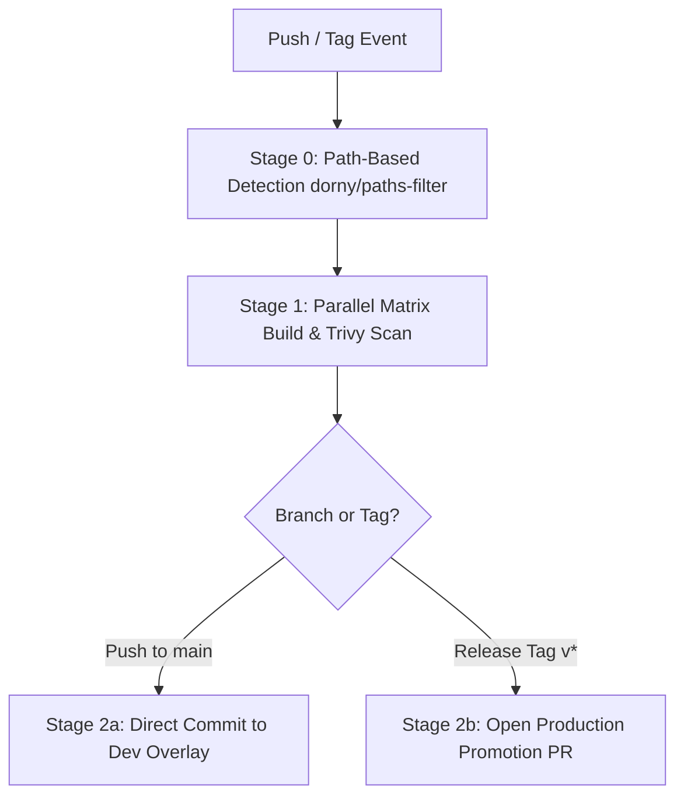

# 🚀 Cloud & DevOps Architecture Deep-Dive: IoT Fire Monitoring Platform

> **Target Audience**: Technical Interview Preparation & Architecture Deep-Dive
> **Author**: Lead Cloud Infrastructure Engineer
> **Repository**: [`FireMonitoringSystem`](file:///home/zett/RiderProjects/FireMonitoringSystem)

---

## 📋 Table of Contents
1. [Bullet 1: Multi-Layer Infrastructure as Code (Terraform)](#1-multi-layer-infrastructure-as-code-terraform)
2. [Bullet 2: 4-Stage GitHub Actions CI/CD Pipeline](#2-4-stage-github-actions-cicd-pipeline)
3. [Bullet 3: GitOps Continuous Delivery & Automated Promotion (ArgoCD)](#3-gitops-continuous-delivery--automated-promotion-argocd)
4. [Bullet 4: Kustomize Base & Overlay Manifest Architecture (17+ Manifests)](#4-kustomize-base--overlay-manifest-architecture-17-manifests)
5. [Bullet 5: Full-Stack Observability Pipeline & 6 Custom Dashboards](#5-full-stack-observability-pipeline--6-custom-dashboards)
6. [Bullet 6: Zero-Downtime DB Schema Migrations (Flyway & ArgoCD Sync Waves)](#6-zero-downtime-db-schema-migrations-flyway--argocd-sync-waves)
7. [Bullet 7: Zero-Trust Kubernetes Network Policies & Micro-Segmentation](#7-zero-trust-kubernetes-network-policies--micro-segmentation)
8. [🎯 Rapid Mock Interview Q&A Cheatsheet](#-rapid-mock-interview-qa-cheatsheet)

---

## 1. Multi-Layer Infrastructure as Code (Terraform)

### 📄 Resume Bullet
> *"Provisioned DigitalOcean Kubernetes (DOKS) cloud infrastructure using Terraform across 4 layered deployments (bootstrap, infra, platform, GitOps) with isolated remote state backends."*

### 🔬 Technical Explanation
In enterprise Cloud Infrastructure, provisioning all resources in a single monolithic `main.tf` creates significant risks: state lock bottlenecks, accidental deletion of critical clusters when modifying minor apps, and circular dependency deadlocks (e.g., trying to install a Helm chart before the Kubernetes API server endpoint exists).

To solve this, the infrastructure is decoupled into **4 isolated execution layers**, each with its own Terraform remote state backend file stored in remote object storage (DigitalOcean Spaces / Azure Blob Storage).

```
dev/
├── 00-bootstrap/     # Layer 0: Remote state buckets, storage containers & state locks
├── 01-infra/         # Layer 1: Cloud VPC, DNS A records, Managed Kubernetes (DOKS/AKS)
├── 02-platform/      # Layer 2: Core Helm Releases (ArgoCD, ingress-nginx, cert-manager)
└── 03-argocd/        # Layer 3: Root ArgoCD App-of-Apps manifest & GitHub App Bot credentials
```

#### How State Isolation & Layer Dependency Works:
* **State Keys**: Each layer maintains a separate key, e.g. `aks-dev/00-bootstrap/terraform.tfstate`, `aks-dev/01-infra/terraform.tfstate`, etc.
* **Data State Inversion**: Downstream layers (like `03-argocd`) read outputs from upstream layers (like `01-infra`) using `data "terraform_remote_state" "infra"` blocks to retrieve the cluster API server endpoint and TLS certificates dynamically.

### 🔗 Code Locations & File Links
* 📘 **IaC Architecture Overview**: [`infrastructure/terraform/README.md`](file:///home/zett/RiderProjects/FireMonitoringSystem/infrastructure/terraform/README.md)
* ⚙️ **Shared Backend Settings**: [`infrastructure/terraform/backend-azure-common.conf`](file:///home/zett/RiderProjects/FireMonitoringSystem/infrastructure/terraform/backend-azure-common.conf)
* 📁 **Layer 0 (Bootstrap)**: [`infrastructure/terraform/environments/aks-dev/00-bootstrap/main.tf`](file:///home/zett/RiderProjects/FireMonitoringSystem/infrastructure/terraform/environments/aks-dev/00-bootstrap/main.tf)
* 📁 **Layer 1 (Infra)**: [`infrastructure/terraform/environments/aks-dev/01-infra/main.tf`](file:///home/zett/RiderProjects/FireMonitoringSystem/infrastructure/terraform/environments/aks-dev/01-infra/main.tf)
* 📁 **Layer 2 (Platform)**: [`infrastructure/terraform/environments/aks-dev/02-platform/main.tf`](file:///home/zett/RiderProjects/FireMonitoringSystem/infrastructure/terraform/environments/aks-dev/02-platform/main.tf)
* 📁 **Layer 3 (GitOps Root)**: [`infrastructure/terraform/environments/aks-dev/03-argocd/main.tf`](file:///home/zett/RiderProjects/FireMonitoringSystem/infrastructure/terraform/environments/aks-dev/03-argocd/main.tf)
* 🧩 **Reusable Modules**: [`infrastructure/terraform/modules/`](file:///home/zett/RiderProjects/FireMonitoringSystem/infrastructure/terraform/modules)

---

## 2. 4-Stage GitHub Actions CI/CD Pipeline

### 📄 Resume Bullet
> *"Built a 4-stage GitHub Actions CI/CD pipeline featuring path-based change detection, parallel matrix container builds, GHCR registry publishing, and automated GitOps PR triggers."*

### 🔬 Technical Explanation
The application repository contains multiple microservices (`api`, `dashboard`, `etl-processor`, `db-migrations`). Rebuilding and scanning every container image on every small commit is wasteful and slow.

The GitHub Actions workflow is engineered with 4 distinct stages:



1. **Stage 0: Path-Based Change Detection**: Uses `dorny/paths-filter@v3` to determine exactly which microservice source directories changed. If only `apps/api` changed, the pipeline outputs `services=["api"]`.
2. **Stage 1: Matrix Build, Trivy Security Scan & GHCR Publish**:
   * Uses Docker Buildx with GitHub Actions caching (`type=gha`).
   * Runs `aquasecurity/trivy-action` locally against the newly built container image to check for HIGH/CRITICAL CVEs before pushing.
   * Publishes scanned images to GitHub Container Registry (`ghcr.io/fauxx/firemonitoringsystem/<service>:<sha>`).
3. **Stage 2a (Dev Automated Deployment)**: Triggered on pushes to `main`. Uses `kustomize edit set image` to update `infrastructure/k8s/overlays/dev/kustomization.yaml` and commits back to `main`.
4. **Stage 2b (Prod Promotion PR Trigger)**: Triggered when a Git release tag (`v*.*.*`) is published. Opens an automated PR against `main` updating `infrastructure/k8s/overlays/prod/kustomization.yaml` using `peter-evans/create-pull-request@v6`.

### 🔗 Code Locations & File Links
* ⚡ **CI/CD Application Pipeline**: [`.github/workflows/app-pipeline.yml`](file:///home/zett/RiderProjects/FireMonitoringSystem/.github/workflows/app-pipeline.yml)
  * **Stage 0 (Paths Filter)**: [Lines 33–65](file:///home/zett/RiderProjects/FireMonitoringSystem/.github/workflows/app-pipeline.yml#L33-L65)
  * **Stage 1 (Matrix & Trivy)**: [Lines 70–144](file:///home/zett/RiderProjects/FireMonitoringSystem/.github/workflows/app-pipeline.yml#L70-L144)
  * **Stage 2a (Dev Deploy)**: [Lines 149–186](file:///home/zett/RiderProjects/FireMonitoringSystem/.github/workflows/app-pipeline.yml#L149-L186)
  * **Stage 2b (Prod PR)**: [Lines 191–245](file:///home/zett/RiderProjects/FireMonitoringSystem/.github/workflows/app-pipeline.yml#L191-L245)

---

## 3. GitOps Continuous Delivery & Automated Promotion (ArgoCD)

### 📄 Resume Bullet
> *"Implemented GitOps continuous delivery using ArgoCD to reconcile Kustomize overlays, automating dev-to-prod environment promotion via GitHub App bot credentials."*

### 🔬 Technical Explanation
Traditional CI/CD pipelines use "push" deployment (running `kubectl apply` inside CI workers with admin credentials). This poses security risks (leaked CI credentials give full cluster control) and leads to configuration drift.

**GitOps (Pull Model)** reverses this paradigm:
* ArgoCD runs inside the Kubernetes cluster and continuously monitors the Git repository.
* When Git overlay files change, ArgoCD automatically pulls the new manifests and reconciles the live state.

#### GitHub App Bot Authentication:
Rather than storing personal access tokens (PATs) or static SSH keys with infinite expiry, GitHub App authentication is used:
* The pipeline uses `actions/create-github-app-token@v1` to generate a short-lived (1-hour) cryptographic token.
* ArgoCD authenticates with GitHub using a `kubernetes_secret_v1` containing the GitHub App ID, Installation ID, and Private Key.

### 🔗 Code Locations & File Links
* 🔑 **GitHub App Secret in Terraform**: [`infrastructure/terraform/environments/aks-dev/03-argocd/main.tf#L59-L77`](file:///home/zett/RiderProjects/FireMonitoringSystem/infrastructure/terraform/environments/aks-dev/03-argocd/main.tf#L59-L77)
* 🐙 **ArgoCD Root Manifest**: [`infrastructure/terraform/environments/aks-dev/03-argocd/main.tf#L84-L114`](file:///home/zett/RiderProjects/FireMonitoringSystem/infrastructure/terraform/environments/aks-dev/03-argocd/main.tf#L84-L114)
* 🛠️ **Local GitOps Bootstrap Script**: [`infrastructure/scripts/local-gitops-bootstrap.sh`](file:///home/zett/RiderProjects/FireMonitoringSystem/infrastructure/scripts/local-gitops-bootstrap.sh)

---

## 4. Kustomize Base & Overlay Manifest Architecture (17+ Manifests)

### 📄 Resume Bullet
> *"Authored 17+ Kubernetes manifests (Deployments, StatefulSets, DaemonSets, PVCs, Ingress, Jobs) utilizing Kustomize base/overlay configurations."*

### 🔬 Technical Explanation
Kustomize is a template-free configuration management tool native to `kubectl`. It uses a **Base / Overlay** pattern:
* **Base (`infrastructure/k8s/base`)**: Contains declared, environment-agnostic Kubernetes objects.
* **Overlays (`infrastructure/k8s/overlays/{dev,prod,local}`)**: Modifies replica counts, ingress hostnames, resource limits, and image tags without duplicating YAML definitions.

#### Workload Archetypes Breakdown:
1. **Deployments (Stateless Application Tier)**:
   * [`apps/api`](file:///home/zett/RiderProjects/FireMonitoringSystem/infrastructure/k8s/base/api/deployment.yaml) — Express REST API server
   * [`apps/dashboard`](file:///home/zett/RiderProjects/FireMonitoringSystem/infrastructure/k8s/base/dashboard/deployment.yaml) — Frontend web user interface
   * [`apps/etl-processor`](file:///home/zett/RiderProjects/FireMonitoringSystem/infrastructure/k8s/base/etl/deployment.yaml) — Python telemetry ETL engine
2. **StatefulSets (Stateful Data Tier & Storage)**:
   * `db` — PostgreSQL database ([`statefulset.yaml`](file:///home/zett/RiderProjects/FireMonitoringSystem/infrastructure/k8s/base/db/statefulset.yaml))
   * `influx` — Time-series database ([`statefulset.yaml`](file:///home/zett/RiderProjects/FireMonitoringSystem/infrastructure/k8s/base/influx/statefulset.yaml))
   * `mqtt` — EMQX/Mosquitto message broker
   * `prometheus` & `loki` — Metrics and log storage engines
3. **DaemonSets (Node-Level Agents)**:
   * `alloy` — Grafana Alloy log collection agent ([`daemonset.yaml`](file:///home/zett/RiderProjects/FireMonitoringSystem/infrastructure/k8s/base/alloy/daemonset.yaml))
   * `node-exporter` — Hardware & OS metrics exporter
   * `cadvisor` — Container resource utilization agent
4. **Jobs & Batch Workloads**:
   * `flyway` — Database schema migration runner ([`job.yaml`](file:///home/zett/RiderProjects/FireMonitoringSystem/infrastructure/k8s/base/flyway/job.yaml))
5. **Ingress & Networking**:
   * `ingress` — Nginx Ingress routing HTTP/HTTPS traffic ([`ingress.yaml`](file:///home/zett/RiderProjects/FireMonitoringSystem/infrastructure/k8s/base/ingress/ingress.yaml))

### 🔗 Code Locations & File Links
* 📂 **K8s Base Directory**: [`infrastructure/k8s/base/`](file:///home/zett/RiderProjects/FireMonitoringSystem/infrastructure/k8s/base)
* 📂 **K8s Overlays Directory**: [`infrastructure/k8s/overlays/`](file:///home/zett/RiderProjects/FireMonitoringSystem/infrastructure/k8s/overlays)

---

## 5. Full-Stack Observability Pipeline & 6 Custom Dashboards

### 📄 Resume Bullet
> *"Architected a full-stack observability pipeline using Prometheus, Grafana, Loki, and Grafana Alloy, configuring 6 custom dashboards for infrastructure health and API metrics."*

### 🔬 Technical Explanation
Observability is split into two complementary telemetry pillars: **Metrics** (numerical time-series data) and **Logs** (timestamped text events).

```
[ Nodes & Pods ] ──(node-exporter & cAdvisor)──> [ Prometheus ] ──> [ Grafana ]
[ Pod Stdout   ] ──(Grafana Alloy DaemonSet) ──> [ Loki       ] ──> [ Grafana ]
```

#### The 6 Custom Provisioned Grafana Dashboards:
1. 📈 **API Performance Dashboard**: [`api-performance.json`](file:///home/zett/RiderProjects/FireMonitoringSystem/infrastructure/k8s/base/grafana/dashboards/application/api-performance.json) — Express API p95/p99 latency, 4xx/5xx status error rates, requests per second.
2. 🪵 **Loki Error Logs Dashboard**: [`loki-error-logs.json`](file:///home/zett/RiderProjects/FireMonitoringSystem/infrastructure/k8s/base/grafana/dashboards/application/loki-error-logs.json) — Real-time log streams, exception traps, LogQL error counters.
3. 🖥️ **Cluster Health Dashboard**: [`cluster-health.json`](file:///home/zett/RiderProjects/FireMonitoringSystem/infrastructure/k8s/base/grafana/dashboards/infrastructure/cluster-health.json) — Node CPU/Memory saturation, disk I/O, pod restart frequency.
4. 🛰️ **MQTT Broker Dashboard**: [`mqtt-broker.json`](file:///home/zett/RiderProjects/FireMonitoringSystem/infrastructure/k8s/base/grafana/dashboards/data-layer/mqtt-broker.json) — Active IoT client connections, published MQTT topic throughput.
5. 🗄️ **PostgreSQL Health Dashboard**: [`postgres-health.json`](file:///home/zett/RiderProjects/FireMonitoringSystem/infrastructure/k8s/base/grafana/dashboards/data-layer/postgres-health.json) — Active database connections, query locks, transaction rollbacks.
6. 🔥 **Fire Main Telemetry Dashboard**: [`fire-main.json`](file:///home/zett/RiderProjects/FireMonitoringSystem/infrastructure/k8s/base/grafana/dashboards/telemetry/fire-main.json) — IoT sensor fire detection status, temperature readings, battery alerts.

### 🔗 Code Locations & File Links
* 📊 **Grafana Dashboards Root**: [`infrastructure/k8s/base/grafana/dashboards/`](file:///home/zett/RiderProjects/FireMonitoringSystem/infrastructure/k8s/base/grafana/dashboards)
* 🦅 **Grafana Alloy DaemonSet**: [`infrastructure/k8s/base/alloy/daemonset.yaml`](file:///home/zett/RiderProjects/FireMonitoringSystem/infrastructure/k8s/base/alloy/daemonset.yaml)
* 📦 **Prometheus Manifests**: [`infrastructure/k8s/base/prometheus/`](file:///home/zett/RiderProjects/FireMonitoringSystem/infrastructure/k8s/base/prometheus)
* 🪵 **Loki Manifests**: [`infrastructure/k8s/base/loki/`](file:///home/zett/RiderProjects/FireMonitoringSystem/infrastructure/k8s/base/loki)

---

## 6. Zero-Downtime DB Schema Migrations (Flyway & ArgoCD Sync Waves)

### 📄 Resume Bullet
> *"Configured Kubernetes Jobs as ArgoCD PreSync hooks to execute zero-downtime database schema migrations using Flyway prior to application pod rollouts."*

### 🔬 Technical Explanation
If a new version of the API deployment starts rolling out before SQL migrations execute, new API pods will crash when querying missing tables or columns.

To achieve **zero-downtime migrations**:
1. Schema changes are written as versioned Flyway SQL scripts under [`infrastructure/k8s/base/sql/`](file:///home/zett/RiderProjects/FireMonitoringSystem/infrastructure/k8s/base/sql).
2. Flyway runs as a Kubernetes `batch/v1 Job`.
3. **ArgoCD Sync Wave Orchestration**:
   * Flyway Job annotation: `argocd.argoproj.io/sync-wave: "5"`
   * Application Pod annotations: `argocd.argoproj.io/sync-wave: "10"`
   * `argocd.argoproj.io/hook-delete-policy: BeforeHookCreation, HookSucceeded` ensures old jobs are cleaned up before running new ones.
4. **Execution Flow**: ArgoCD executes Wave 5 (Flyway Job) first. Only when the Flyway Job finishes with exit code `0` does ArgoCD proceed to Wave 10, initiating the rolling update of API, Dashboard, and ETL pods.

### 🔗 Code Locations & File Links
* 📄 **Flyway Job Manifest**: [`infrastructure/k8s/base/flyway/job.yaml`](file:///home/zett/RiderProjects/FireMonitoringSystem/infrastructure/k8s/base/flyway/job.yaml#L8-L9)
* 🗃️ **SQL Migrations Folder**: [`infrastructure/k8s/base/sql/`](file:///home/zett/RiderProjects/FireMonitoringSystem/infrastructure/k8s/base/sql)
* 🏷️ **API Sync Wave Annotation**: [`infrastructure/k8s/base/api/deployment.yaml#L8`](file:///home/zett/RiderProjects/FireMonitoringSystem/infrastructure/k8s/base/api/deployment.yaml#L8)

---

## 7. Zero-Trust Kubernetes Network Policies & Micro-Segmentation

### 📄 Resume Bullet
> *"Implemented Zero-Trust Kubernetes Network Policies with default-deny postures and micro-segmentation to restrict lateral container traffic."*

### 🔬 Technical Explanation
By default in Kubernetes, any pod can talk to any other pod across any namespace. If an attacker compromises a vulnerable web pod, they can move laterally to access the database or ArgoCD management API.

**Zero-Trust Networking** assumes the internal network is untrusted:
1. **Default-Deny Posture**: Setting `podSelector: {}` with `policyTypes: [Ingress, Egress]` instantly blocks all incoming and outgoing network traffic in the namespace unless explicitly allowed.
2. **Micro-Segmentation Whitelisting**:
   * Ingress to ArgoCD is restricted solely to the `ingress-nginx` namespace on ports `8080` and `8081`.
   * Egress from ArgoCD is restricted to `kube-system` DNS (port 53), the Kubernetes API server (port 443), and external HTTPS registries.

### 🔗 Code Locations & File Links
* 🔒 **ArgoCD Network Policy**: [`infrastructure/k8s/base/argocd/networkpolicy.yaml`](file:///home/zett/RiderProjects/FireMonitoringSystem/infrastructure/k8s/base/argocd/networkpolicy.yaml#L1-L153)
* 📖 **Networking Setup Guide**: [`infrastructure/k8s/NETWORKING_SETUP.md#L341-L354`](file:///home/zett/RiderProjects/FireMonitoringSystem/infrastructure/k8s/NETWORKING_SETUP.md#L341-L354)

---

## 🎯 Rapid Mock Interview Q&A Cheatsheet

### Q1: "Why did you separate Terraform into 4 layers instead of using one state file?"
> **Answer**: "A monolithic state file increases blast radius and introduces state-lock contention. By splitting into 4 layers (`00-bootstrap`, `01-infra`, `02-platform`, `03-argocd`), we decouple infrastructure lifecycles. We can update Helm releases in `02-platform` without risking modifications to our core Kubernetes cluster in `01-infra`."

### Q2: "How do you ensure PRs don't build unnecessary containers or push unsafe images?"
> **Answer**: "We use `dorny/paths-filter@v3` in Stage 0 of our GitHub Actions pipeline to detect which paths changed. In Stage 1, Docker Buildx builds the image locally so Trivy can perform CVE scanning before pushing to GHCR."

### Q3: "How does your Dev vs Production deployment promotion work?"
> **Answer**: "Dev deployments happen automatically on push to `main` via automated commits updating `overlays/dev/kustomization.yaml`. Production promotions require publishing a Git release tag (`v*.*.*`), which triggers GitHub Actions to open an automated Promotion PR targeting `overlays/prod/kustomization.yaml` using GitHub App bot credentials."

### Q4: "How do you avoid database schema migration race conditions during deployment?"
> **Answer**: "We leverage ArgoCD Sync Waves. We annotate our Flyway migration Kubernetes Job with `sync-wave: 5` and our application deployments with `sync-wave: 10`. ArgoCD blocks application pod rollouts until the Flyway migration job completes successfully."

### Q5: "What is a default-deny Network Policy and why is it important?"
> **Answer**: "A default-deny policy uses `podSelector: {}` to block all ingress and egress traffic by default. This enforces a Zero-Trust architecture so an attacker compromising a web pod cannot move laterally to database or control plane pods."
