# ⚙️ Automated CI/CD Pipelines & DevSecOps Strategy

The **Fire Monitoring System** features a production-grade CI/CD and DevSecOps orchestration engine. This document details the continuous integration, continuous delivery (GitOps), and continuous infrastructure deployment (IaC) architectures that automate the transition from code commit to cloud resource.

---

## 🏗️ Pipeline Topography

Our deployment model separates concerns into three distinct pipelines to optimize execution speeds, preserve workflow security boundaries, and prevent runner queue bloat.

```mermaid
graph TD
    subgraph "1. App Delivery app-pipeline.yml"
        A_Detect[Change Detection] -->|Paths Filter| A_Build[Parallel Compilation]
        A_Build -->|Image Push| A_Dev[GitOps Dev PR Bumping]
        A_Dev -->|Merge to main| A_Prod[GitOps Prod Promotion]
    end

    subgraph "2. IaC Orchestration terraform-deploy.yml"
        T_Val[Parallel Validate & Plan] -->|Sequential Execution| T_Dep[Bootstrap ➔ Infra ➔ Platform ➔ GitOps]
    end

    subgraph "3. Manifest Validation k8s-manifest-validation.yml"
        K_Mock[Secrets Mocking] --> K_Val[Validate Dev/Prod/Local overlays]
    end
```



---

## 🚀 1. Continuous Integration & GitOps Delivery (`app-pipeline.yml`)

The application deployment workflow is designed as a secure, pull-request-driven GitOps pipeline.

### Stage 0: Paths-Based Change Detection
To optimize runner usage, the pipeline checks where code modifications occurred using `dorny/paths-filter@v3`:
- **`apps/api/**`** ➔ Triggers the Node.js API build.
- **`apps/dashboard/**`** ➔ Triggers the Nginx Web portal build.
- **`apps/etl-processor/**`** ➔ Triggers the Python pandas ETL worker build.
- **`infrastructure/k8s/base/sql/**`** ➔ Triggers the Flyway migrations container build.

*Manual execution via `workflow_dispatch` defaults to executing builds for all services.*

### Stage 1: Parallel Matrix Compilation
Services requiring updates are built concurrently in a matrix runner:
*   **Authentication**: Logs into the GitHub Container Registry (`ghcr.io`) using the temporary workflow `GITHUB_TOKEN`.
*   **Version Tagging**: Every build is tagged with a short Git SHA (the first 7 characters of the commit hash) to ensure artifact immutability.
*   **Image Registries**: Builds are pushed to the container registry on push-to-main or manual triggers.

### Stage 2: Manifest Image Tag Promotion (GitOps)
Direct API-based changes to live Kubernetes clusters are a security risk. Instead, the pipeline uses a secure, PR-driven manifest override workflow:
1.  **Tag Injection**: A GitHub Runner runs `kustomize edit set image` on `infrastructure/k8s/overlays/dev/`.
2.  **Pull Request Generation**: Using `peter-evans/create-pull-request@v6` with a **GitHub App token**, the pipeline creates a branch `gitops-image-bump-{sha}` and opens a Pull Request against the `main` branch.
3.  **Production Promotion**: Once merged to `main`, a mirror job updates `infrastructure/k8s/overlays/prod/` and submits a promotion PR.

---

## 🛠️ 2. Infrastructure as Code Pipeline (`terraform-deploy.yml`)

Infrastructure updates run through a reusable workflow model (`terraform-reusable.yml`) featuring validation gates and sequential apply pipelines.

### Parallel PR Verification
Any PR touching `infrastructure/terraform/` launches validation runners:
- Runs static formatting tests (`terraform fmt -check`).
- Runs compile checks (`terraform validate`).
- Generates a transient dry-run execution plan (`terraform plan -refresh=false`).

### Sequential Deployment
To prevent state resource race conditions, environment deployments execute sequentially:

$$\text{00-bootstrap} \longrightarrow \text{01-infra} \longrightarrow \text{02-platform} \longrightarrow \text{03-argocd}$$

### Immutable Applies
We use a strict plan-to-apply abstraction pattern to ensure that the resources provisioned match the reviewed plans exactly:
1.  **Planner Runner**: Runs `terraform plan -out=tfplan.binary` and uploads the compiled binary as a workflow artifact.
2.  **Applier Runner**: Downloads the plan artifact and executes `terraform apply tfplan.binary`. This prevents any configuration drift or local adjustments from modifying resources in transit.

---

## 🛡️ 3. Composite Action Contract (`terraform-contract`)

To keep pipeline code DRY (Don't Repeat Yourself), initialization and verification steps are encapsulated in a custom action (`.github/actions/terraform-contract/action.yml`):

1.  **Format Gate**: Validates that environment directories meet standard regex rules:
    ```bash
    [[ "${TF_ENVIRONMENT}" =~ ^[a-z0-9][a-z0-9_-]{1,62}$ ]]
    ```
2.  **Environment Secret Assertion**: Verifies that the required environment keys are present before starting a run:
    - **`bootstrap`**: `DO_TOKEN`, `TF_STATE_ACCESS_KEY`, `TF_STATE_SECRET_KEY`
    - **`infra`**: `DO_TOKEN`
    - **`platform`/`gitops`**: `DO_TOKEN`, `GITHUB_APP_ID`, `GITHUB_APP_PRIVATE_KEY`
3.  **Tfvars Construction**: Programmatically creates `runtime.auto.tfvars` from active runner environments.
4.  **S3-Compatible Remote State Backend**: Dynamically initializes state storage backends using DigitalOcean Spaces S3-compatibility parameters:
    ```bash
    terraform init -backend-config="../../../backend-common.conf" -backend-config="backend.conf"
    ```

---

## 🔍 4. Manifest Syntax Quality Gates (`k8s-manifest-validation.yml`)

The manifest validation workflow runs on every pull request to verify the layout of your overlays before they are reconciled by ArgoCD.

*   **Mocking Secret Layouts**: To prevent Kustomize builds from failing on missing secret definitions (which are git-ignored for safety), the runner checks for `secrets.yaml` and copies the example file if it's missing:
    ```bash
    if [ ! -f infrastructure/k8s/overlays/dev/secrets.yaml ]; then
      cp infrastructure/k8s/overlays/dev/secrets.yaml.example infrastructure/k8s/overlays/dev/secrets.yaml
    fi
    ```
*   **Overlay Validations**: Verifies that `dev`, `prod`, and `local` overlays compile cleanly using `kustomize build`.

---

## 🔒 Security & Compliance Checklist

*   [x] **Zero Persistent PATs**: Uses short-lived GitHub App tokens instead of high-privilege Personal Access Tokens (PATs).
*   [x] **State Lock Isolation**: Concurrency locks are separated per environment layer to prevent state conflicts.
*   [x] **Pull-Request-Driven Deployments**: Direct deployments to the Kubernetes cluster are disabled; all manifest updates run through automated Pull Requests.
*   [x] **Version Locking**: Terraform provider versions are centralized in `global/versions.tf` and symlinked at runtime to prevent version drift.
