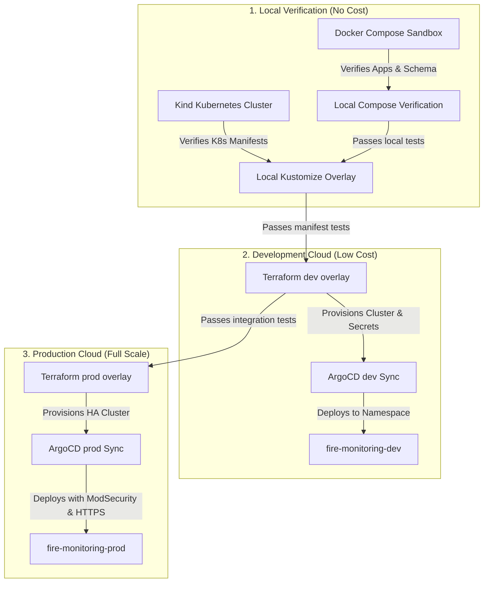

# End-to-End Deployment & Verification Guide

This guide details the step-by-step lifecycle of the **Fire Monitoring System** from local development up to production deployment on DigitalOcean. It also includes strategic **Credit Optimization Tips** to ensure you do not exhaust your hosting credits during testing.

---

## 🗺️ Deployment Pipeline Lifecycle

The deployment flow follows a promotion strategy from a local development sandbox to a production-grade Kubernetes cluster on the cloud.



---

## 🟢 Phase 1: Local Sandbox via Docker Compose

Docker Compose is the fastest way to verify database connection logic, the Python ETL loop, and the authentication handshakes.

### 1. Start the Local Stack
Use the root `Makefile` helper to start all containers (Postgres, InfluxDB, Mosquitto MQTT, Express API, Nginx Dashboard, ETL Worker, Loki, Grafana, Prometheus):
```bash
make local-up
```

### 2. Verify Core Services
Ensure services are running and accessible on the host:
*   **Nginx Web UI / Reverse Proxy**: [http://localhost:8080](http://localhost:8080)
*   **Express API Health**: [http://localhost:8000/health](http://localhost:8000/health)
*   **Prometheus UI**: [http://localhost:9090](http://localhost:9090)
*   **Grafana Dashboard**: [http://localhost:3000](http://localhost:3000) (Use login: `admin` / `admin`)

### 3. Run MQTT Simulation
Launch the edge device simulator locally to stream telemetry:
```bash
cd apps/simulators
python -m venv venv
source venv/bin/activate
pip install -r requirements.txt
python mcu_sim.py --host localhost --port 1883 --h-id HOUSE_LOCAL --interval 5.0
```
Check the Nginx Web UI and Grafana analytics page to ensure telemetry aggregates populate.

### 4. Tear Down
Always tear down local containers and clean up volumes when finished:
```bash
make local-down
```

---

## 🟡 Phase 2: Local Kubernetes Validation via Kind

Before applying manifests to the cloud, validate your Kustomize overlays inside a local **Kind (Kubernetes in Docker)** cluster to ensure that network policies, configurations, and ingresses boot cleanly.

> [!IMPORTANT]
> **Always validate in Kind first.** Troubleshooting manifest syntax errors and pod start crashes (such as ImagePullBackOff or database connection drops) in the cloud consumes time and digital resources, quickly draining your DO credits.

### 1. Spin Up the Kind Cluster
Use the provided configuration to expose ports `80` and `443` on your local machine:
```bash
kind create cluster --config kind-config.yaml --name fire-monitoring
```

### 2. Build & Load Local Images
Build the container images and load them directly into the Kind cluster's image registry:
```bash
make kind-load
```
*(Note: Images are built and loaded under the `localhost/` registry namespace to match the Kustomize `local` overlay configuration).*

### 3. Deploy the Local Kustomize Overlay
Create the namespace and apply the local configurations:
```bash
make deploy-local
```

### 4. Verify Local Kubernetes Status
*   **Check Pods**: Ensure all deployments scale up and flyway schema migration jobs run to completion:
    ```bash
    kubectl get pods -n fire-monitoring-local
    ```
*   **Test Ingress/Routing**: Map `dev.fires.systems` and `ops.dev.fires.systems` to `127.0.0.1` in your `/etc/hosts` file. Open `http://dev.fires.systems` in your browser to verify Nginx and API communication.

### 5. Tear Down local Kind
To free up local system memory and CPU:
```bash
kind delete cluster --name fire-monitoring
```

---

## 🔵 Phase 3: Cloud Infrastructure Deployment (Terraform)

Once local validation succeeds, deploy your cloud infrastructure on DigitalOcean.

### 1. Export Cloud Credentials
Ensure your shell contains the target environment API variables (see [SETUP_GUIDE.md](./SETUP_GUIDE.md) for scopes):
```bash
export TF_VAR_do_token="dop_v1_xxxxxxxx..."
export TF_VAR_github_token="ghp_xxxxxxxx..."
export AWS_ACCESS_KEY_ID="your_spaces_key"
export AWS_SECRET_ACCESS_KEY="your_spaces_secret"
export AWS_EC2_METADATA_DISABLED=true
```

### 2. Deploy Sequentially (Dev Environment Example)
Run Terraform layer-by-layer under `infrastructure/terraform/environments/dev/`:

#### Layer 00: Bootstrap (Remote State & DO Spaces)
Creates the S3-compatible remote state store.
```bash
cd infrastructure/terraform/environments/dev/00-bootstrap
terraform init -reconfigure -backend-config=backend.conf -backend-config="key=environments/dev/terraform.tfstate"
terraform apply
```

#### Layer 01: Core Infrastructure (VPC & Kubernetes Cluster)
Provisions the network and the managed DigitalOcean Kubernetes (DOKS) cluster.
```bash
cd ../01-infra
terraform init -reconfigure -backend-config=backend.conf -backend-config="key=environments/dev/terraform.tfstate"
terraform apply
```

#### Layer 02: Platform Controllers (Ingress, Cert-Manager, Secrets)
Deploys core controllers and creates base application secrets directly in the cluster namespace.
```bash
cd ../02-platform
terraform init -reconfigure -backend-config=backend.conf -backend-config="key=environments/dev/terraform.tfstate"
terraform apply
```

#### Layer 03: GitOps Bootstrap (ArgoCD Applications)
Installs ArgoCD and registers the root GitOps application tracking this repository.
```bash
cd ../03-argocd
terraform init -reconfigure -backend-config=backend.conf -backend-config="key=environments/dev/terraform.tfstate"
terraform apply
```

---

## 🟣 Phase 4: GitOps Application Delivery

Once Layer 03 completes, ArgoCD reconciles the cluster state to match the overlays in this repository.

1.  **Get ArgoCD Admin Password**:
    ```bash
    kubectl -n argocd get secret argocd-initial-admin-secret -o jsonpath="{.data.password}" | base64 -d
    ```
2.  **Access the ArgoCD Console**:
    Visit the load balancer IP address printed by the Terraform Layer 03 outputs or check the DNS record `ops.dev.fires.systems` (or `ops.fires.systems` for production).
3.  **Automatic Promotion**:
    *   Pushing code to the `main` branch triggers GitHub Actions to build and push container images to GitHub Container Registry (GHCR).
    *   GitHub Actions automatically updates the image tags in the `overlays/dev/kustomization.yaml` overlay.
    *   ArgoCD detects the change and syncs the new pods automatically.

---

## 💸 Strategic Credit Optimization (How to save money)

Managed Kubernetes clusters, load balancers, and persistent disk volumes consume cloud provider credits continuously. Follow these rules to maximize credit lifespan:

### 1. Scale down Dev Clusters when inactive
If you must keep the cluster online but want to reduce compute cost overnight, scale the DOKS node pool capacity to a minimum:
*   In the DigitalOcean console or via Terraform variables, decrease the dev pool node count to **1 node**.
*   Alternatively, run this command to temporarily scale down replica pools of non-essential services to 0:
    ```bash
    kubectl scale deployment/api deployment/dashboard deployment/etl-processor --replicas=0 -n fire-monitoring-dev
    ```

### 2. Set Dev Node Pools to low-resource VMs
In `infrastructure/terraform/environments/dev/01-infra/main.tf`, make sure the node pool uses standard nodes instead of memory-optimized/premium VMs:
*   Recommended VM size for dev: `s-2vcpu-4gb` (Standard node).

### 3. Immediate Tear-Down Plan (Clean up)
If you are finished testing and want to save all remaining credits, perform a complete tear-down of the infrastructure.
> [!WARNING]
> You must run the `terraform destroy` commands in the **reverse order** of deployment to avoid leaving dangling resources (like load balancers or volumes) that continue to generate billing charges.

Execute the tear-down sequence:
```bash
# 1. Destroy GitOps application layers
cd infrastructure/terraform/environments/dev/03-argocd
terraform destroy -auto-approve

# 2. Destroy Platform resources & Ingress (this releases the DO Load Balancer!)
cd ../02-platform
terraform destroy -auto-approve

# 3. Destroy Managed Kubernetes Cluster & VPC
cd ../01-infra
terraform destroy -auto-approve

# 4. Destroy Spaces Buckets (only if no longer needed)
cd ../00-bootstrap
terraform destroy -auto-approve
```

Verify in the DigitalOcean cloud portal that **no active load balancers, volumes, or Droplets remain** in your account.
