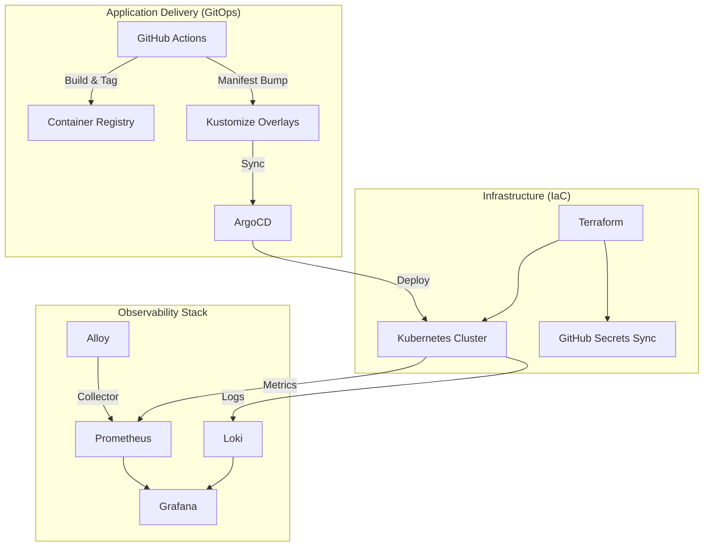

# Platform Engineering Portfolio: FireMonitoringSystem

This documentation provides a deep dive into the **Infrastructure as Code (IaC)**, **GitOps**, and **Automated Lifecycle Management** of the FireMonitoringSystem. 

The project demonstrates a production-grade DevOps approach to managing a multi-service IoT platform, leveraging Terraform for cloud orchestration and Kubernetes for container orchestration.

## 🏗️ High-Level Architecture

The system is designed for high observability, reliability, and automated delivery.

## 📂 Documentation Deep-Dives

To explore specific technical domains, please refer to the following guides:

1.  **[01: Terraform & Multi-Layer IaC](./01_TERRAFORM_IAC.md)**
    *   State management strategy (dev/prod isolation).
    *   Sequential layer orchestration (`bootstrap` -> `infra` -> `platform` -> `gitops`).
    *   Reusable GitHub Actions for Terraform lifecycle.
2.  **[02: Kubernetes & GitOps Flow](./02_KUBERNETES_GITOPS.md)**
    *   Kustomize-driven configuration management.
    *   ArgoCD integration for true GitOps state reconciliation.
    *   Dense observability stack configuration (Loki, Grafana, Alloy).
3.  **[03: Automated CI/CD Pipelines](./03_CI_CD_PIPELINES.md)**
    *   Service-agnostic Docker build pipelines.
    *   Automated PR-based manifest updates (GitOps Bumping).
    *   Deployment promotion strategies.
4.  **[04: Application Architecture & Topology](./04_APP_ARCHITECTURE.md)**
    *   Microservices overview (API, ETL, Dashboard).
    *   Data persistence (PostgreSQL + InfluxDB).
    *   IoT Integration (MQTT/Mosquitto).
5.  **[05: End-to-End Deployment & Verification](./DEPLOYMENT_GUIDE.md)**
    *   Step-by-step local validation (Docker Compose & Kind).
    *   DigitalOcean cloud setup and Terraform layer apply.
    *   GitOps promotion and credit-saving cost control strategies.

## 🚀 Project Status & Active Roadmap

This project is under active development as a platform engineering laboratory. 

### Current Engineering Challenges:
- **Grafana Embedding Integration:** Currently refining the security handshake (Auth Proxy / Anonymous Access) between the Nginx-based Dashboard and the Grafana instance to enable seamless, embedded real-time analytics.
- **Enhanced Zero-Trust:** Actively expanding NetworkPolicies to include cross-namespace communication for the monitoring stack.

### Future Milestones:
- [ ] Transitioning from local-path storage to cloud-managed block storage for high availability.
- [ ] Implementing automated secret rotation via Vault or External Secrets Operator.

---

## 🛠️ Key Technical Stack
- **IaC:** Terraform
- **Orchestration:** Kubernetes, ArgoCD, Kustomize
- **CI/CD:** GitHub Actions
- **Observability:** Prometheus, Grafana, Loki, Alloy, Telegraf
- **Data Layers:** PostgreSQL (Flyway), InfluxDB, MQTT
- **Runtime:** Node.js, Python, Nginx
